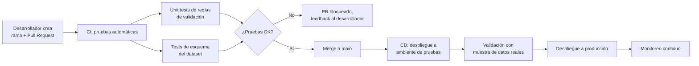

# Ejercicio 1: Proceso automatizado y controlado (CI/CD) para el dataset de teléfonos de clientes

## Objetivo

Diseñar un proceso que garantice que el dataset de números de teléfono de clientes sea
**confiable, validado y mantenible en el tiempo**, usando prácticas de CI/CD para
controlar cada cambio antes de que llegue a producción.

## Fuentes de datos

| Fuente | Formato | Frecuencia |
|---|---|---|
| CRM (Salesforce) | API / export incremental | Diaria |
| App móvil / Portal cliente | Eventos (actualización de datos de contacto) | Near real-time |
| Call center | Registros de interacción con validación manual | Diaria |
| Formularios web | Captura directa | Diaria |

Cada fuente tiene su propio formato de teléfono (con o sin indicativo, con guiones,
espacios, etc.), por lo que la primera responsabilidad del proceso es **estandarizar**
antes de validar.

## Arquitectura del flujo (medallion: bronze → silver → gold)

```mermaid
flowchart TD
    subgraph Fuentes["Fuentes de datos"]
        A1[CRM]
        A2[App móvil]
        A3[Call center]
        A4[Formularios web]
    end

    subgraph Landing["Landing / Bronze"]
        B[Ingesta cruda<br/>sin transformar]
    end

    subgraph Silver["Silver: estandarización y validación"]
        C1[Estandarizar formato<br/>E.164 + indicativo país]
        C2[Validar longitud y formato]
        C3[Detectar duplicados por cliente]
        C4{¿Pasa validación?}
        C5[Cuarentena +<br/>alerta al equipo dueño]
    end

    subgraph Gold["Gold: dataset confiable"]
        D[Tabla curada de teléfonos<br/>por cliente]
    end

    subgraph Consumo["Consumo"]
        E1[Servicio al cliente]
        E2[Marketing / Comunicaciones]
        E3[KPIs de calidad<br/>(Ejercicio 2)]
    end

    A1 & A2 & A3 & A4 --> B
    B --> C1 --> C2 --> C3 --> C4
    C4 -- No --> C5
    C4 -- Sí --> D
    D --> E1
    D --> E2
    D --> E3
```

## Pipeline de CI/CD

El código de transformación y las reglas de validación viven en un repositorio Git,
no directamente en el ambiente de producción. Cada cambio pasa por control de calidad
automatizado antes de desplegarse.



**Herramientas propuestas:** GitHub Actions (o Azure DevOps Pipelines) para correr las
pruebas en cada Pull Request; si el flujo se implementa sobre Microsoft Fabric, el
código de los notebooks de transformación se versiona con la integración nativa de
Git de Fabric, y la promoción entre workspaces (dev → test → prod) se controla con
Deployment Pipelines de Fabric, que actúan como la etapa de CD.

## Mantenimiento y monitoreo

- **Alertas de calidad**: si el % de registros que caen en cuarentena supera un umbral
  (p. ej. 2% diario), se dispara una alerta al equipo de datos.
- **Reprocesamiento**: si una regla de validación cambia (p. ej. se agrega un nuevo
  formato de país válido), se debe poder re-ejecutar la validación sobre el histórico
  sin reprocesar toda la ingesta desde el origen — por eso la capa bronze se conserva
  intacta.
- **Revisión periódica**: el pipeline y las reglas de validación se revisan
  trimestralmente o cuando una fuente cambia su formato de origen.

## Supuestos

- Se asume que existe un identificador único de cliente consistente entre todas las
  fuentes (maestro de clientes).
- Se asume que el equipo de datos tiene autoridad para definir el formato estándar
  final del teléfono (E.164).
