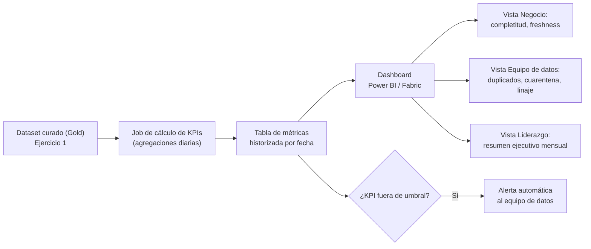

# Ejercicio 2: Veeduría de calidad y trazabilidad del dataset de teléfonos

## Objetivo

A partir del proceso diseñado en el [Ejercicio 1](../ejercicio1/README.md), definir un
mecanismo que permita a los equipos de negocio hacer **veeduría de la calidad de datos**
y **trazabilidad del dato**, exponiendo KPIs claros y accionables.

## Metadatos de trazabilidad (linaje)

Para poder calcular estos KPIs y responder "de dónde vino este dato y qué le pasó",
cada registro del dataset debe conservar, además del teléfono:

| Campo | Descripción |
|---|---|
| `fuente_origen` | Sistema del que vino el registro (CRM, App, Call center, Formulario web) |
| `fecha_ingesta` | Timestamp en que el registro llegó a la capa bronze |
| `fecha_ultima_actualizacion` | Última vez que el registro cambió |
| `version_regla_validacion` | Versión de las reglas de validación aplicadas (permite auditar cambios de criterio) |
| `estado_validacion` | Válido / En cuarentena / Corregido manualmente |

Con esto, cualquier registro final se puede rastrear hasta su origen y saber exactamente
qué transformación y validación sufrió.

## KPIs de calidad de datos

| KPI | Fórmula | Frecuencia | Consumidor |
|---|---|---|---|
| % Completitud | clientes con teléfono válido / total clientes | Diaria | Negocio |
| % Duplicados | registros duplicados detectados / total registros | Diaria | Equipo de datos |
| % En cuarentena | registros que fallan validación / total ingestados | Diaria | Equipo de datos |
| % Válidos por fuente | teléfonos válidos / total, agrupado por `fuente_origen` | Semanal | Negocio |
| Freshness (antigüedad) | días desde `fecha_ultima_actualizacion` hasta hoy, promedio | Semanal | Negocio |
| % Corregidos manualmente | registros con `estado_validacion = Corregido manualmente` / total | Mensual | Liderazgo |

## KPIs de trazabilidad

| KPI | Fórmula | Frecuencia | Consumidor |
|---|---|---|---|
| Cobertura de linaje | registros con `fuente_origen` no nulo / total | Diaria | Equipo de datos |
| Tiempo de ingesta a disponibilidad | `fecha_ingesta` → publicación en capa gold, promedio en horas | Diaria | Equipo de datos |
| Cambios de regla en el periodo | conteo de `version_regla_validacion` distintas usadas en el mes | Mensual | Equipo de datos |

## Mecanismo de veeduría (arquitectura)

El job de cálculo de KPIs corre después de cada ejecución del pipeline del Ejercicio 1,
guarda los resultados de forma **historizada** (no solo el valor actual, sino la serie
en el tiempo) para poder ver tendencias, y alimenta un dashboard con vistas distintas
según el consumidor.

## A quién le sirve cada vista

- **Negocio (servicio al cliente, marketing):** completitud y freshness — les dice si
  pueden confiar en el dato para contactar al cliente hoy.
- **Equipo de datos:** duplicados, cuarentena y cobertura de linaje — les dice dónde
  actuar para mejorar la calidad.
- **Liderazgo:** resumen ejecutivo mensual con tendencia de los KPIs principales,
  para decisiones de inversión en calidad de datos.

## Supuestos

- Se asume que existe una capa de almacenamiento historizado (no solo el snapshot
  actual) para poder calcular tendencias y freshness.
- Se asume que los umbrales de alerta (p. ej. % de cuarentena máximo aceptable) los
  define el equipo de datos junto con negocio, y pueden ajustarse en el tiempo.
